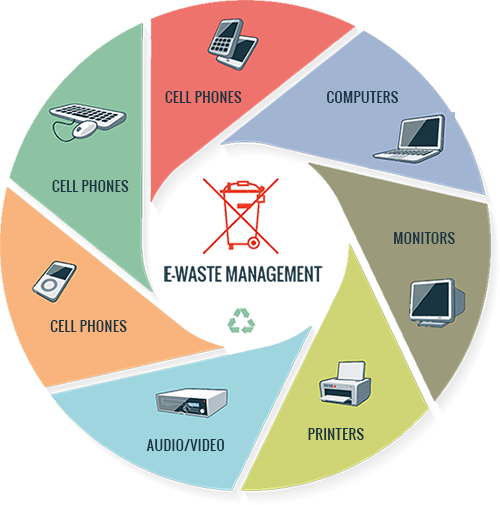
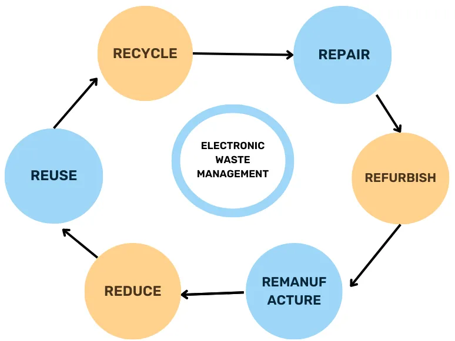

# Smart India Hackathon Workshop
# Date:09.05.2024
## Register Number: 212223230026
## Name: AVINASH
## Problem Title
E-Waste Facility Locator
## Problem Description
Website that tells you the location of the nearest e-waste collection and recycling facility. Offers educational pop-ups on the harmful components of your e-waste and their effects on the environment and human health if not disposed correctly. There could be an option to input the model of your old device and earn credit points relative to the amount of precious metals recovered from the device if disposed correctly.
## Problem Creater's Organization
Ministry of Environment
## Idea
Here are some ideas to enhance your E-Waste Facility Locator beyond the core functionalities:

#### Advanced Search & Filtering:
Allow users to filter facilities based on accepted e-waste categories (e.g., computers, TVs, batteries).

#### Interactive Features:
Develop a quiz or interactive map to educate users about responsible e-waste practices in a fun way. Include a "responsible disposal guide" with step-by-step instructions on data wiping and preparing e-waste for recycling.

#### Data & Insights:
Implement a system to track user-reported e-waste types and quantities for data analysis by the Ministry of Environment.
## Proposed Solution / Architecture Diagram

## Use Cases

## Technology Stack
Technology Stack
Here's a breakdown of the technology stack suitable for developing the E-Waste Facility Locator website:

#### Front-End:
HTML: The foundation for building the website's structure and content. CSS: Responsible for styling the website's visual elements like layout, fonts, and colors. JavaScript Framework: A framework like ReactJS can offer a more dynamic and interactive user experience. ReactJS allows you to build reusable components and manage complex data flows efficiently.

#### Back-End:
Database: A database like PostgreSQL is a solid choice for storing information like: E-waste facility details (location, contact information, accepted waste types) Educational content (text, images, videos) User data (if implementing the reward system) - usernames, points, etc. (ensure secure storage practices like hashing passwords) Device data (if implementing the reward system) - model numbers and corresponding precious metal content (partner with e-waste recycling companies for this data)

#### API Integration:
Google Maps API: This will be crucial for implementing the facility locator functionality. It allows users to search for nearby facilities, visualize locations on a map, and get directions. Optional API: If implementing the reward system, you might need to integrate with an API provided by e-waste recycling companies to access data on precious metal content in various devices.

## Dependencies
E-Waste Facility Locator website for the Smart India Hackathon.
#### Development Dependencies:
front-end and back-end,Database Management System

#### Development Tools:
Code Editors, Version Control System

#### Budjet for project:
50,000-75,000

#### Time period:
15days-1month
